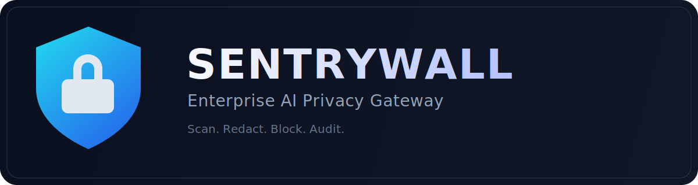
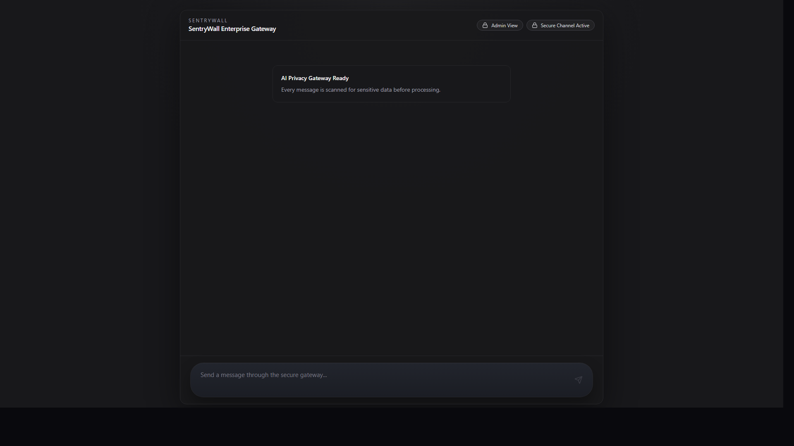
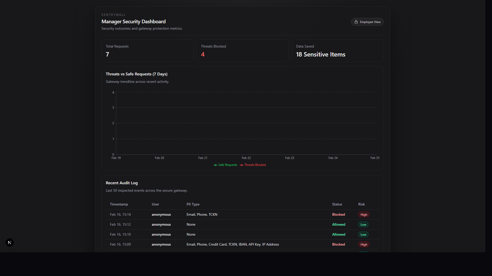

# SentryWall

<p align="center">
  
</p>

<p align="center">
  <strong>Enterprise AI Privacy Gateway</strong><br />
  Stop sensitive data before it reaches your LLM.
</p>

<p align="center">
  <a href="https://github.com/onatozmenn/SentryWall/stargazers"></a>
  <a href="https://github.com/onatozmenn/SentryWall/network/members"></a>
  <a href="https://github.com/onatozmenn/SentryWall/issues"></a>
  <a href="./LICENSE"></a>
</p>

SentryWall sits between employees and AI models. Every prompt is scanned for PII and secrets, high-risk requests are blocked before model access, and all events are logged for security teams.

## Screenshots

### Employee Secure Chat



### Manager Security Dashboard



## Why SentryWall

- Protects sensitive data at the gateway layer instead of relying on user behavior.
- Enforces real blocking for high-risk content (API keys, TCKN, credit card data).
- Gives security managers visibility with audit logs and trend analytics.
- Keeps developer experience simple: one monorepo, one `pnpm dev` command.

## Core Capabilities

- Secure chat endpoint: `POST /api/chat/secure`
- PII and secret handling:
  - `Email` -> `[EMAIL_REDACTED]`
  - `Phone` -> `[PHONE_REDACTED]`
  - `Credit Card` -> `[CREDIT_CARD_REDACTED]`
  - `TCKN` -> `[TCKN_REDACTED]`
  - `IBAN` -> `[IBAN_REDACTED]`
  - `API Key` (OpenAI/AWS/GitHub/generic secret) -> `[API_KEY_REDACTED]`
  - `IP Address` -> `[IP_REDACTED]`
  - `Address` -> `[ADDRESS_REDACTED]`
- Risk-aware policy:
  - `High` risk -> request is blocked, never sent to LLM
  - `Medium/Low` risk -> redacted payload can continue
  - `No PII` -> allowed
- Real-time employee UI (`/`) and manager dashboard (`/admin`)
- SQLite-backed audit logs and 7-day threat trend stats

## How It Works

```text
Employee Prompt
   -> SentryWall Gateway (FastAPI)
      -> PII/Secret Detection + Redaction
      -> Risk Policy Decision
         -> High Risk: Block (no LLM call)
         -> Medium/Low: Send sanitized prompt to Azure OpenAI
      -> Persist audit log (SQLModel + SQLite)
   -> Return secure response + security report
```

## Tech Stack

- Frontend: Next.js App Router, React, TypeScript, Tailwind CSS, shadcn/ui, Zustand, Recharts
- Backend: FastAPI, Pydantic Settings, SQLModel, OpenAI Python SDK (Azure OpenAI), regex-based detection
- Tooling: pnpm workspaces, uv, pytest

## Monorepo Structure

```text
SentryWall/
  backend/     FastAPI gateway, policy engine, audit APIs
  frontend/    Employee chat and manager dashboard
  docs/
    assets/    Branding assets (logo)
    screenshots/
```

## Quick Start

### 1) Install dependencies

```bash
pnpm install
```

### 2) Configure environment

Create local env files:

- `backend/.env` from `backend/.env.example`
- `frontend/.env.local` from `frontend/.env.local.example`

`frontend/.env.local`

```env
NEXT_PUBLIC_API_BASE_URL=http://localhost:8000
```

`backend/.env`

```env
CORS_ORIGINS=http://localhost:3000,http://127.0.0.1:3000
API_HOST=0.0.0.0
API_PORT=8000
AZURE_OPENAI_API_KEY=
AZURE_OPENAI_ENDPOINT=
AZURE_OPENAI_DEPLOYMENT_NAME=
AZURE_OPENAI_API_VERSION=2024-02-15-preview
```

### 3) Run

```bash
pnpm dev
```

This starts:

- Frontend: `http://localhost:3000`
- Backend: `http://localhost:8000`

### 4) Verify

```bash
pnpm test:backend
pnpm --filter frontend lint
pnpm --filter frontend build
```

## API Overview

### Health

- `GET /health`

Response:

```json
{ "status": "SentryWall Secure Gateway Active" }
```

### Secure Chat

- `POST /api/chat/secure`

Request:

```json
{ "message": "My email is test@test.com" }
```

Response:

```json
{
  "original_response": "Handled securely.",
  "security_report": { "redacted_items": ["Email"] }
}
```

Blocked response example:

```json
{
  "original_response": "Request blocked: high-risk sensitive data was detected and the message was not sent to the AI model.",
  "security_report": { "redacted_items": ["Credit Card"] }
}
```

### Admin

- `GET /api/admin/logs` -> latest 50 audit records
- `GET /api/admin/stats` -> KPIs + 7-day trendline dataset

## Contributing

Issues, ideas, and PRs are welcome. If this project is useful, consider starring the repo to help more teams discover privacy-first AI gateway patterns.

## License

Licensed under the MIT License. See [LICENSE](./LICENSE).
